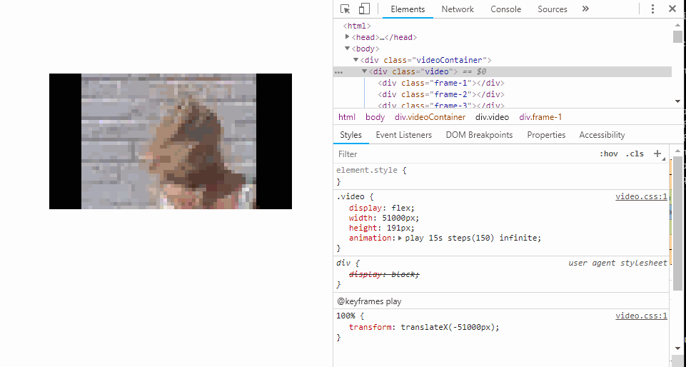

# video2css

video2css allows you to convert a video file to a CSS animation using either box shadows or base64 image backgrounds.

## Installation

**Prerequisites**: `ffmpeg` installed and in your PATH.

1. `npm i`
2. `node video2css.css --file video.mp4 --fps 5 --seconds 10`

## Commands

```
  Usage: video2css.js [options] [command]

  Commands:
    help     Display help
    version  Display version

  Options:
    -b, --base64          Uses base64 instead of box shadows (disabled by default)
    -f, --file            File to use
    -F, --fps <n>         Limit FPS of video to parse (defaults to 5)
    -h, --help            Output usage information
    -o, --output [value]  Output Directory (defaults to "./output")
    -q, --quality <n>     Pixel width when using box shadows (1 = best) (defaults to 10)
    -s, --seconds <n>     Seconds (defaults to 5)
    -S, --skipdecode      Skips video decoding (disabled by default)
    -v, --version         Output the version number
    -w, --width <n>       Width of video (defaults to 340)
```

## Preview



## ...Why?

¯\\\_(ツ)\_/¯
